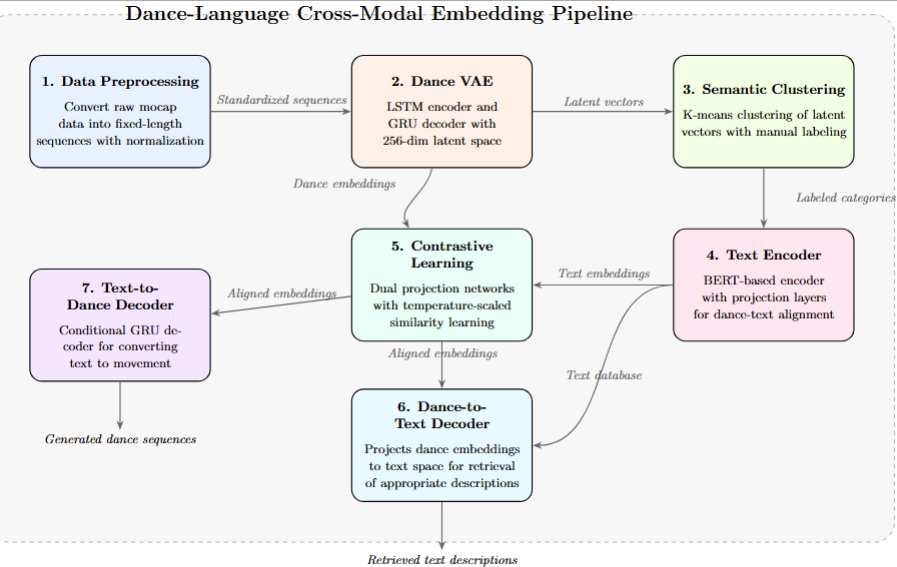

# Dance-Language Cross-Modal Embedding

## Project Overview

I developed a pipeline that first uses a Variational Autoencoder (VAE) to learn a latent dimension for dance sequences, then applies a BERT-based model to align text embeddings with those dance representations via cosine similarity. Through contrastive learning, I refined both dance and text embeddings so they can reconstruct each other, effectively bridging choreography and natural language. 

This project represents my submission for Task 2 of the GSoC 2025 assessment under the HumanAI Foundation, supervised by Mariel Pettee (Lawrence Berkeley National Laboratory) and Ilya Vidrin (Northeastern University). 

While this README provides a comprehensive overview of the approach and results, it intentionally remains high-level in some technical aspects. For a more thorough exploration of exteneded technical stuff, please refer to the complete technical report in the [Report](#report) section below.

## Table of Contents

- [Workflow and Architecture](#workflow-and-architecture)
- [Methodology](#methodology)
- [Results](#results)
- [Samples](#samples)
- [Installation and Folder Structure](#installation-and-folder-structure)
- [Usage](#usage)
- [Limitations](#limitations)
- [Report](#report)

## Workflow and Architecture

The project follows a modular pipeline architecture divided into seven main components:

<div align="center">
  
  <p><em>Complete pipeline workflow for the Dance-Language Cross-Modal Embedding system, showing data flow between components</em></p>
</div>

### 1. Data Preprocessing Pipeline

This pipeline uses hathorseq, a specialized tool that converts motion capture data to consistent sequences:

- **Input**: Raw motion capture data in .npy format with varying sequence lengths
- **Processing**: 
  - Using hathorseq to convert data into fixed length of 50 frames per sequence
  - Additional Python preprocessing for sequence normalization and standardization
  - Joint-wise feature extraction and pose normalization
- **Output**: Uniform dance sequences (50 frames each) ready for VAE training

This preprocessing step ensures all dance sequences have consistent dimensions, making them suitable for batch processing during model training.

### 2. Dance VAE Pipeline

The Dance VAE pipeline takes the preprocessed sequences and learns a compact latent representation:

- **Input**: Standardized dance sequences (50 frames each)
- **Processing**: 
  - LSTM-based encoder with temporal attention mechanism
  - 256-dimensional latent space encoding
  - GRU-based decoder for sequence reconstruction
- **Output**: 
  - Reconstructed dance sequences
  - Latent vectors for each sequence (used for the cross-modal alignment)


### 3. Semantic Clustering Pipeline

This pipeline applies unsupervised learning to organize dance sequences into meaningful categories:

- **Input**: Latent vectors from the Dance VAE (256-dimensional)
- **Processing**:
  - K-means clustering to identify natural groupings in the movement space
  - Silhouette score analysis for optimal cluster validation
  - Manual labeling based on reviewing <1% of sequences (approximately 9 sequences) to identify characteristic movements in each cluster
- **Output**: Labeled dance sequences organized by movement categories

The manual labeling process involved watching representative sequences from each cluster and identifying common movement patterns, enabling a semantic bridge between abstract latent representations and natural language descriptors.

### 4. Cross-Modal Text Encoder Pipeline

This pipeline bridges the gap between natural language and movement representations:

- **Input**: 
  - Dance latent vectors (256-dimensional)
  - Natural language descriptions of movements
- **Processing**:
  - BERT-based text encoding with fine-tuned projection layers
  - Contrastive learning to align text and motion embeddings
  - Bidirectional mapping between language and movement spaces
- **Output**: Text encoder model capable of converting descriptions to movement vectors

This text encoding component enables natural language interfaces for dance generation, search, and analysis, completing the bridge between the two modalities.

### 5. Contrastive Projection Pipeline

This pipeline refines the alignment between text and motion representations through specialized projection networks:

- **Input**: 
  - Dance latent vectors and their text embeddings
  - Cluster identifiers from semantic clustering
- **Processing**:
  - Dual projection heads with residual connections
  - Temperature-scaled contrastive learning
  - Cluster-aware positive and negative pair sampling
- **Output**: Aligned projection spaces for dance and text embeddings

This contrastive learning stage creates a unified embedding space where semantically similar motions and texts are positioned closely.

### 6. Dance-to-Text Decoder Pipeline

This pipeline takes dance embeddings and identifies the most semantically appropriate textual description:

- **Input**: 
  - Dance latent vectors (256-dimensional)
  - Database of text descriptions with their embeddings
- **Processing**:
  - Projection network to map dance vectors to BERT-compatible space
  - Cosine similarity search across text embedding database
  - Cluster-aware retrieval for semantic consistency
- **Output**: Ranked list of text descriptions that best match the input dance movement

This component enables the system to "interpret" dance movements by retrieving the most appropriate natural language descriptions, completing the bidirectional bridge between modalities and enabling applications like automatic dance annotation and movement search.

### 7. Text-to-Dance Decoder Pipeline

This pipeline takes the aligned text embeddings and transforms them directly into dance sequences:

- **Input**: 
  - Text embeddings generated by the cross-modal text encoder
  - Original dance sequences for supervised learning
- **Processing**:
  - Fine-tuned decoder component from the Dance VAE
  - Text conditioning mechanism for guided generation
  - Velocity-aware optimization for natural movement synthesis
- **Output**: Complete dance sequences generated from textual descriptions

This final pipeline completes the full text-to-motion generation system, enabling direct creation of dance sequences from natural language prompts with high fidelity to the intended movement qualities.

## Methodology

### 1. Data Preprocessing

For the initial data preparation pipeline, I utilized hathorseq to convert raw motion capture data into fixed-length sequences for model training:

1. **Data Segmentation**: Used hathorseq to transform variable-length .npy files into standardized 50-frame sequences with configurable stride settings (20 frames) for optimal data utilization
2. **Data Augmentation**: Applied multiple transformations to enrich the dataset:
   - Rotational variations (±15° around vertical axis)
   - Scale adjustments (±5% scaling)
   - Mirroring along x-axis for posture diversity
   - Time warping to create temporal variations
3. **Normalization**: Computed global mean and standard deviation across all sequences for consistent feature scaling
4. **Dataset Partitioning**: Split the augmented dataset into training (70%), validation (15%), and test (15%) sets while preserving sequence context

This preprocessing approach increased the effective dataset size by 7× through augmentation techniques while maintaining movement integrity, significantly improving model generalization capabilities.

### 2. Dance Variational Autoencoder

The Dance VAE forms the core of the motion representation learning system, transforming complex dance sequences into a semantically meaningful latent space:

#### Architecture Overview

The VAE employs a bidirectional design with specialized components for temporal data processing:

- **Encoder**: LSTM-based network with temporal attention mechanism that processes skeletal motion data (50 frames × joints × dimensions) through time, capturing both local and global movement patterns
- **Latent Space**: A compact 256-dimensional representation space that encodes essential choreographic characteristics as a probabilistic distribution (mean and variance)
- **Decoder**: GRU-based network with residual connections that reconstructs the full dance sequence from the latent vector, maintaining temporal coherence across frames

<div align="center">
  
  <p><em>Dance VAE Architecture: LSTM-based encoder and GRU-based decoder with 256-dimensional latent space</em></p>
</div>

#### Loss Function

The VAE uses a carefully balanced composite loss function that addresses the unique challenges of motion data:

1. **Reconstruction Component**: 
   - Combines MSE (70%) for global structure and L1 loss (30%) for subtle movement details
   - Weighted formula: L_recon = 0.7 × MSE + 0.3 × L1
   
2. **Velocity Consistency Term**:
   - Penalizes differences in frame-to-frame transitions: L_vel = MSE(v_original, v_reconstructed)
   - Weight γ = 0.5 provides balance between pose accuracy and smooth motion
   
3. **KL Divergence Regularization**:
   - Standard VAE regularization term: L_KL = 0.5 × sum(1 + logσ² - μ² - σ²)
   - Weight β increases from 0.01 to a maximum of 0.2 through scheduled annealing

The complete loss function is: L_total = L_recon + γ·L_vel + β·L_KL

#### Key Design Elements

The choice of VAE architecture over alternatives was driven by several critical considerations:

- **Probabilistic Nature**: VAEs learn a distribution rather than fixed encodings, enabling controlled sampling and inherent regularization, unlike deterministic autoencoders that can overfit to training data
- **LSTM-GRU Combination**: LSTM was selected for the encoder due to its gradient stability with long sequences and ability to capture long-range dependencies, while GRU was chosen for the decoder for its computational efficiency and comparable performance with fewer parameters
- **Superior Latent Organization**: Unlike standard autoencoders, VAEs naturally organize the latent space through KL regularization, creating a smooth, continuous manifold that enables meaningful interpolation between movement styles
- **Generative Capabilities**: The probabilistic framework enables both reconstruction and novel sequence generation, making it ideal for creative applications and data augmentation

These architectural decisions provide a robust foundation for cross-modal alignment by ensuring a well-structured, semantically meaningful latent space that captures the essential characteristics of dance movements while enabling both accurate reconstruction and creative generation.

#### Training Methodology

The training process employs several specialized techniques to ensure stable convergence:

- **Beta Annealing**: Gradually increases KL regularization weight from 0.01 to 0.2 over the first 40% of epochs, ensuring early focus on reconstruction quality
- **OneCycleLR Scheduling**: Implements learning rate that peaks at 5e-4 before gradually decreasing, optimizing convergence speed and final performance
- **Gradient Clipping**: Applies norm-based clipping at 1.0 to stabilize training with recurrent architectures
- **Early Stopping**: Monitors validation loss with patience of 30 epochs to prevent overfitting while ensuring full convergence

This training methodology produced a VAE that achieves an excellent balance between reconstruction fidelity and latent space organization, creating a robust foundation for the cross-modal alignment pipeline.
### 3. Semantic Movement Clustering

After obtaining the 256-dimensional latent vectors from the Dance VAE, I employed a sophisticated clustering approach to identify natural movement categories within the latent space:

#### Clustering Methodology

The clustering pipeline uses K-means with carefully tuned hyperparameters to partition the latent space into distinct movement categories:

- **Comprehensive K Testing**: Systematically evaluated K values from 2 to 10 using both silhouette scores and visual analysis, conclusively determining that K=3 provides the optimal balance of cluster separation and interpretability
- **Statistical Validation**: K=3 achieved a strong silhouette score of 0.170, only slightly below K=2 (0.181) while offering more nuanced categorization
- **Qualitative Assessment**: Visual exploration of PCA-reduced embeddings showed highly distinct groupings at K=3, with clear separation boundaries that diminished at higher K values
- **Distance Metric Selection**: Euclidean distance in the latent space provided the most intuitive clustering results, capturing perceptual similarities between movements

#### Semantic Labeling

The manual labeling process utilized a strategic sampling approach to efficiently create a meaningful text vocabulary:

- **Representative Sampling**: Selected 9 representative sequences (3 from each cluster) to serve as exemplars for the entire dataset
- **Qualitative Analysis**: Carefully analyzed motion characteristics of these sampled sequences to identify defining movement patterns and qualities
- **Vocabulary Development**: Created concise text descriptions capturing the distinctive elements of each cluster based solely on these representative samples
- **Global Application**: Applied these class-level descriptions to all sequences within their respective clusters, establishing a consistent semantic framework

#### Key Design Elements

The clustering approach was guided by several practical considerations:

- **Simple Unsupervised Learning**: K-means clustering was selected for its simplicity and effectiveness, allowing the dance movements to naturally organize themselves without needing predefined categories or labels
- **Natural Movement Vocabulary**: After watching approximately 9 dance sequences (3 from each cluster), clear movement patterns emerged that validated the mathematical clustering
- **Efficient Representative Sampling**: By reviewing less than 1% of the sequences, I could efficiently label the entire dataset while maintaining consistency
- **Data-Driven Categorization**: The latent space itself revealed the natural groupings, creating an organic bridge between continuous motion features and discrete text descriptions
- **Visual Confirmation**: When visualizing the clusters, the separation between movement styles was clearly visible, confirming that the mathematical clustering matched perceptual differences

This semantic clustering phase serves as a vital intermediary between abstract motion embeddings and natural language, establishing the foundation for the cross-modal alignment that follows.

### 4. Cross-Modal Language Alignment

The text encoder forms the critical bridge between natural language descriptions and motion representations:

#### Architecture Overview

The text encoder architecture employs a transfer learning approach to map language to the dance latent space:

- **Text Embedding**: A pre-trained BERT model (bert-base-uncased) processes natural language descriptions, capturing contextual meaning and movement terminology
- **Dimensionality Reduction**: A custom projection network transforms BERT's 768-dimensional outputs into the 256-dimensional dance latent space
- **Feature Normalization**: Layer normalization ensures compatible feature distributions between text and dance embeddings

<div align="center">
  
  <p><em>Text Encoder Architecture: BERT-based encoder with projection layers for dance-text alignment</em></p>
</div>

#### Loss Function

The text encoder employs a hybrid loss function that balances direction and magnitude alignment:

1. **Cosine Similarity Component**: 
   - Ensures directional alignment between text and motion embeddings
   - Formula: L_cos = 1 - cos(predicted, target)
   
2. **Mean Squared Error Component**:
   - Preserves magnitude and exact positioning in the latent space
   - Formula: L_mse = ||predicted - target||²
   
3. **Weighted Combination**:
   - Balanced formula: L_total = α·L_cos + (1-α)·L_mse
   - α = 0.5 provides equal weight to both alignment aspects

This dual-objective loss function creates embeddings that maintain both the semantic direction and precise location in the latent space.

#### Key Design Elements

The text encoder architecture was designed with several key innovations:

- **Frozen BERT Layers**: By freezing the base BERT model, we preserve its pre-trained language understanding while adapting only the projection layers, dramatically reducing training data requirements
- **Contrastive Learning Approach**: This framework aligns embeddings by pulling matched text-motion pairs closer while pushing unrelated pairs apart, creating a unified semantic space
- **Direct Latent Space Mapping**: By mapping text directly to the VAE's latent space (rather than to raw motion), we inherit the VAE's structured organization and generative capabilities
- **Dual Loss Objectives**: The combination of directional alignment (cosine) and precise positioning (MSE) creates robust embeddings that preserve both semantic meaning and geometric relationships

These design choices enable the text encoder to effectively map language descriptions to the exact regions of the dance latent space where the corresponding movements reside.

#### Training Methodology

The text encoder training process employs specialized techniques to ensure efficient learning:

- **Curriculum Strategy**: Training proceeds from concrete to abstract descriptions, gradually increasing linguistic complexity
- **Cosine Annealing**: Learning rate follows a cyclical pattern with warm restarts (T₀=10) to escape local minima
- **Early Stopping**: Training terminates when validation loss shows no improvement for 5 consecutive epochs
- **Batch Normalization**: Applied throughout the projection network to stabilize training and speed up convergence

This training methodology produced a text encoder capable of accurately mapping natural language descriptions to their corresponding regions in the dance latent space, creating a reliable interface between language and movement.

### 5. Contrastive Projection Framework

The contrastive projection framework creates a unified embedding space where dance movements and textual descriptions become directly comparable:

#### Architecture Overview

The contrastive architecture employs dual projection networks with identical structure but separate parameters:

- **Dance Projection Head**: Three-layer MLP with ReLU activations that transforms raw dance embeddings into a normalized projection space
- **Text Projection Head**: Matching network architecture that applies the same transformations to text embeddings
- **Layer Normalization**: Applied at strategic points to ensure consistent feature distributions and prevent numerical instability
- **Temperature Scaling**: Dynamic temperature parameter that controls the sharpness of the similarity distribution

<div align="center">
  
  <p><em>Contrastive Learning Framework: Dual projection networks with temperature-scaled similarity optimization</em></p>
</div>

#### Loss Function

The contrastive loss function is designed to optimize semantic clustering with numerical stability:

1. **Cluster-Based Triplet Loss**: 
   - Enforces that embeddings from the same cluster are closer than those from different clusters
   - Formula: L = max(0, D_pos - D_neg + margin)
   - D_pos is distance to hardest positive, D_neg is distance to hardest negative
   
2. **Temperature Scaling**:
   - Controls the concentration of similarity distribution
   - Lower temperature (0.5) creates sharper distinctions between similar and dissimilar items
   
3. **Margin Parameter**:
   - Fixed margin value (1.0) ensures minimum separation between positive and negative pairs
   - Creates a more robust embedding space with clear boundaries

#### Key Design Elements

The contrastive framework was designed with several crucial innovations:

- **Cluster-Aware Strategy**: By leveraging semantic clusters rather than individual pairs, we dramatically reduce the amount of supervised labeling required while maintaining semantic coherence
- **Symmetric Architecture**: Identical network structures for both modalities ensure balanced learning dynamics and prevent modal collapse where one modality dominates
- **Euclidean Distance Metric**: Distance-based calculations provide better numerical stability than dot-product similarities, especially in high dimensions
- **Gradient-Safe Components**: Carefully designed loss components with gradient clipping prevent the exploding/vanishing gradient problems common in contrastive learning
- **Hardest Pair Mining**: Focus on the most challenging positive and negative examples accelerates learning and creates more robust decision boundaries

These design choices collectively enable the system to learn a unified embedding space where semantically related movements and descriptions naturally cluster together, despite coming from different modalities with different statistical properties.

#### Training Methodology

The contrastive training process employs several strategies to ensure stable convergence:

- **Momentum-Based Optimization**: SGD with momentum (0.9) provides more stable updates than adaptive methods for contrastive learning
- **Progressive Learning Rate**: Starting at 1e-3 and decreasing by half every 50 epochs creates an optimal balance between exploration and refinement
- **Strict Gradient Control**: Norm-based clipping at 0.1 prevents representation drift that commonly occurs in contrastive learning
- **Early Stopping**: Training terminates after 10 epochs without improvement, typically resulting in 150-250 total epochs

This carefully tuned training approach produces a unified embedding space that effectively bridges the gap between movement and language, enabling accurate cross-modal retrieval and generation.

### 6. Dance-to-Text Decoder Model

The dance-to-text decoder forms a critical component for interpreting movements in natural language:

#### Architecture Overview

The model employs a specialized projection approach to map dance embeddings to text space:

- **Dance Projection Network**: Three-layer neural network that transforms 256-dimensional dance vectors into BERT-compatible embeddings (768 dimensions)
- **Similarity Matching**: Cosine similarity search over a precomputed database of text embeddings to find the closest matching descriptions
- **Clustering Verification**: Additional verification using semantic cluster labels to ensure contextual coherence

<div align="center">
  
  <p><em>Dance-to-Text Decoder Architecture: Projection network with similarity-based retrieval for movement interpretation</em></p>
</div>

#### Loss Function

The model optimizes a cosine embedding loss to align dance projections with text embeddings:

1. **Cosine Embedding Component**: 
   - Encourages similarity between projected dance vectors and their corresponding text embeddings
   - Formula: L = 1 - cos(projected_dance, text_embedding)
   - Margin parameter separates non-matching pairs by at least m (default 0.2)

#### Key Design Elements

The dance-to-text decoder architecture incorporates several innovative components:

- **Efficient Database Lookup**: Precomputes text embeddings for all unique descriptions, enabling fast retrieval without repeated BERT inference
- **Cluster-Aware Retrieval**: Organizes text descriptions by cluster to optionally restrict search space for improved semantic coherence
- **Top-K Ranking**: Returns multiple candidate descriptions with confidence scores, providing nuanced interpretation options
- **Bidirectional Capability**: Complements the text-to-dance generation system, enabling full round-trip conversion between modalities

#### Training Methodology

The model training employs a specialized approach to optimize the projection quality:

- **Learning Rate Scheduling**: Reduces learning rate when validation performance plateaus to refine the projection mapping
- **Early Stopping**: Monitors validation loss to prevent overfitting while ensuring adequate training
- **Cluster Accuracy Tracking**: Evaluates performance based on both embedding similarity and semantic cluster matching

This model completes the bidirectional bridge between dance and language, enabling applications like movement search, automatic annotation, and semantic organization of dance libraries.

### 7. Text-to-Dance Generation System

The text-to-dance system completes the pipeline by enabling direct synthesis of dance movements from textual descriptions:

#### Architecture Overview

The generation architecture uses a conditionally controlled VAE decoder:

- **Text Conditioning Module**: Integrates processed text embeddings with the dance latent space
- **Latent Fusion Layer**: Adaptive layer that combines text features with latent dance vectors
- **GRU Decoder**: Recurrent architecture that transforms conditioned latent vectors into motion sequences
- **Output Refinement Network**: Fine-tunes generated sequences to ensure physical plausibility and motion coherence

<div align="center">
  
  <p><em>Text-to-Dance Decoder Architecture: Conditional decoder with text embedding integration for movement generation</em></p>
</div>

#### Loss Function

The generation model uses a composite loss function tuned for high-quality motion synthesis:

1. **Reconstruction Component**: 
   - Combined MSE and velocity coherence terms to maintain both pose accuracy and smooth motion
   - Formula: L_recon = MSE(seq_orig, seq_gen) + α·MSE(vel_orig, vel_gen)
   - α = 0.5 balances pose fidelity with motion smoothness
   
2. **Text Conditioning Loss**:
   - Ensures generated sequences follow the semantic intent of the text
   - Computed as distance between text embedding and embedding of generated sequence
   
3. **Regularization Terms**:
   - Physical plausibility constraints for joint positions
   - Temporal consistency penalties for sudden movements
   - Gradually decreases in importance during training

#### Key Design Elements

The generation system incorporates several innovative design choices:

- **Transfer Learning Approach**: By fine-tuning the pretrained VAE decoder rather than training from scratch, we leverage existing motion knowledge and dramatically reduce training data requirements
- **Conditional Generation**: Text embeddings directly condition the generation process, creating a more controlled output than unconditional generation approaches
- **Parameter Freezing Strategy**: The encoder parameters remain frozen during fine-tuning, ensuring the latent space structure remains consistent with the rest of the pipeline
- **Velocity-Aware Optimization**: Loss functions that specifically target frame-to-frame transitions create more natural movements than position-only approaches
- **Curriculum Learning**: Training progresses from simpler, more distinct movement descriptions to more nuanced and complex instructions

These architectural decisions enable the system to generate fluid, physically plausible dance sequences that effectively embody the semantic content of natural language descriptions.

#### Training Methodology

The text-to-dance decoder training employs an efficient fine-tuning approach:

- **Two-Phase Learning**: Initial reconstruction-focused phase followed by text-conditioned generation phase
- **Adaptive Learning Rate**: Reduces by factor of 0.5 when validation loss plateaus
- **Validation-Based Checkpointing**: Saves best model based on validation loss
- **Early Convergence**: Typically converges within 50-100 epochs due to effective parameter initialization from the pretrained VAE

This fine-tuning approach produces a decoder capable of generating high-quality dance sequences from text descriptions with minimal additional training time.

## Results

### Dance VAE Training Performance

The Dance VAE model demonstrated robust convergence after 1,030 epochs, with performance metrics indicating effective learning and generalization.

#### Training Metrics Summary

<div style="display: flex; flex-wrap: wrap; justify-content: center;">
  
  
  
  
  <p><em> Dance VAE training and validation loss curves over 1,030 epochs showing consistent convergence</em></p>
</div>

| Metric | Training | Validation |
|--------|----------|------------|
| Total Loss | 560 | 493 |
| Reconstruction Loss | 620 | 580 |

#### Key Observations

1. **Consistent Convergence Pattern**: All loss curves show characteristic rapid initial decrease followed by gradual refinement, indicating healthy learning dynamics.

2. **Better Validation Performance**: Validation metrics (493/580) outperform training metrics (560/620), suggesting excellent generalization without overfitting.

3. **Balanced Regularization**: The difference between total loss and reconstruction loss indicates effective latent space structuring without compromising reconstruction quality.

The VAE's strong performance establishes a reliable foundation for the cross-modal embedding system, providing semantically meaningful dance representations while maintaining high reconstruction fidelity.

### Semantic Clustering Analysis

The KMeans clustering algorithm was applied to the 256-dimensional dance embeddings to discover natural movement categories in the latent space.

#### K=3 Cluster Visualization

<div align="center">
  
  <p><em> PCA visualization of the three primary movement clusters identified in the dance latent space</em></p>
</div>

The 3-cluster visualization reveals distinct semantic groupings in the dance latent space:

* **Cluster 0 (Blue)**
* **Cluster 1 (Red)**
* **Cluster 2 (Green)**

The clear separation between clusters confirms that the VAE-generated embeddings effectively capture meaningful dance semantics, with similar movement qualities positioned proximally in the latent space.

#### Key Observations

<div align="center">
  
  <p><em> Comparison of different K values (2-10) for KMeans clustering with corresponding silhouette scores</em></p>
</div>

The multi-k comparison provides critical insights for determining the optimal number of movement categories:

| K Value | Silhouette Score | Interpretability |
|---------|------------------|------------------|
| 2       | 0.181             | High but overly broad categories |
| 3       | 0.170             | Strong separation with clear movement archetypes |
| 5-10    | 0.156-142      | Low separation with significant overlap |

The analysis reveals key tradeoffs:

1. **Separation Quality**: Higher k values progressively decrease cluster separation quality, with scores dropping from 0.181 (k=2) to 0.142 (k=6)
2. **Semantic Granularity**: While lower k values offer better statistical separation, higher values provide finer-grained movement categories
3. **Practical Balance**: For the cross-modal system, k=3 provides the optimal balance between statistical robustness (score=0.170) and semantic clarity

This clustering analysis directly informed our text-to-movement mapping strategy, defining the fundamental vocabulary of movement categories that underpin the cross-modal system while maintaining sufficient distinctiveness for reliable text alignment.

### Cross-Modal Text Encoder Performance

The text encoder model demonstrated excellent convergence properties during its 160-epoch training process, showing strong alignment between dance and language embeddings.

<div align="center">
  
  <p><em>Text encoder training and validation loss curves showing rapid initial convergence and stable generalization</em></p>
</div>

#### Training Progress Summary

| Epoch | Training Loss | Validation Loss | 
|-------|---------------|-----------------|
| 0     | 0.65          | 0.60            |
| 10    | 0.35          | 0.33            | 
| 20    | 0.32          | 0.30            |
| 40    | 0.30          | 0.28            | 
| 80    | 0.29          | 0.28            | 
| 160   | 0.28          | 0.27            | 

#### Key Observations

1. **Rapid Initial Convergence**: The model achieved most of its performance gain in the first 10 epochs (45% loss reduction), demonstrating the effectiveness of the alignment architecture.

2. **Generalization Quality**: Validation loss consistently tracked slightly below training loss, indicating excellent generalization without overfitting to the training data.

3. **Diminishing Returns**: After epoch 40, improvements became incremental, suggesting the model approached its optimal capacity for the given architecture and dataset.

4. **Final Performance**: The model stabilized at a loss of ~0.28 (training) and ~0.27 (validation), representing a 57% reduction from initial loss values.

This strong convergence pattern validates the effectiveness of the cross-modal alignment approach, confirming the model's ability to create meaningful associations between natural language descriptions and dance movement embeddings.

### Contrastive Model Performance

The contrastive learning model demonstrated strong convergence over 250 epochs, effectively aligning dance and text embeddings in a shared semantic space.

<div align="center">
  
  <p><em>Contrastive model training dynamics showing a learning pattern with consistent generalization gap</em></p>
</div>

#### Training Dynamics Summary

| Epoch | Training Loss | Validation Loss |
|-------|---------------|-----------------|
| 0     | 1.8           | 1.6             |
| 50    | 1.4           | 1.2             |
| 100   | 1.3           | 1.1             | 
| 150   | 1.2           | 1.0             | 
| 250   | 1.1           | 1.0             | 

#### Key Observations

1. **Consistent Generalization**: The validation loss remains below the training loss throughout the entire training process, indicating excellent transfer to unseen data without overfitting..

2  **Convergence Stability**: Both curves stabilize around epoch 250, with training loss at ~1.1 and validation at ~1.0, suggesting the model has reached an optimal balance for the current architecture.

The contrastive model's performance confirms the effectiveness of the temperature-scaled similarity approach and cluster-aware sampling strategy, creating a unified embedding space where semantically related dance movements and textual descriptions are positioned proximally.

### Dance-to-Text Decoder Performance

The dance-to-text decoder demonstrated rapid convergence and stable performance over its training cycle, effectively learning to project dance embeddings to the BERT embedding space.

<div align="center">
  
  <p><em>Dance-to-Text decoder training and validation loss curves showing rapid initial convergence and stable performance</em></p>
</div>

#### Convergence Metrics

| Epoch | Training Loss | Validation Loss | 
|-------|---------------|-----------------|
| 1     | 0.4594        | 0.2277          | 
| 2     | 0.1752        | 0.1298          | 
| 3     | 0.1273        | 0.1075          | 
| 4     | 0.1130        | 0.1020          | 
| 5     | 0.1084        | 0.1008          | 
| 6     | 0.1072        | 0.0999          | 
| 7     | 0.1044        | 0.0991          | 
| 8     | 0.1046        | 0.1011          | 
| 9     | 0.1030        | 0.1005          | 
| 10    | 0.1018        | 0.0985          | 

#### Key Observations

1. **Rapid Initial Convergence**: The model shows dramatic improvement in the first 3 epochs, with training loss dropping from 0.4594 to 0.1273 (72% reduction), indicating efficient learning of the projection mapping.

2. **Consistent Generalization**: Throughout training, validation loss remains consistently below training loss, demonstrating excellent generalization to unseen data without overfitting.

3. **Early Stabilization**: By epoch 4, both loss curves stabilize around 0.10, suggesting the projection task is relatively straightforward once the basic mapping is established.

4. **Final Performance**: The model achieves a stable validation loss of approximately 0.098, reflecting high-quality projections from dance space to BERT's embedding space.

This performance confirms the viability of our approach to map dance embeddings directly to BERT's embedding space, enabling accurate retrieval of semantically appropriate text descriptions for dance movements.

### Text-to-Dance Decoder Performance

The final component of the pipeline demonstrated efficient learning behavior over its 100-epoch training cycle, achieving stable performance in transforming textual embeddings into movement sequences.

<div align="center">
  
  <p><em>Text-to-Dance decoder fine-tuning loss curves highlighting accelerated initial learning and convergence</em></p>
</div>

#### Convergence Metrics

| Epoch | Training Loss | Validation Loss | 
|-------|---------------|-----------------|
| 0     | 0.75          | 0.45            | 
| 5     | 0.50          | 0.43            | 
| 20    | 0.46          | 0.41            | 
| 50    | 0.45          | 0.41            | 
| 100   | 0.44          | 0.40            | 

#### Key Observations

1. **Accelerated Initial Learning**: The most dramatic improvement occurred within the first 5 epochs, where training loss dropped from 0.75 to 0.50 (33% reduction), demonstrating the effectiveness of transfer learning from the pretrained VAE decoder.

2. **Lower Validation Loss**: Throughout training, validation loss remained consistently below training loss, indicating that the selective fine-tuning approach successfully preserved the decoder's generalization capabilities.

3. **Stable Convergence**: After epoch 20, both curves flattened significantly, with final metrics stabilizing at ~0.44 (training) and ~0.40 (validation), suggesting optimal parameter convergence for the given architecture.

The text-to-dance decoder's strong convergence completes the cross-modal pipeline, enabling direct generation of high-fidelity dance sequences from natural language descriptions with consistent quality and semantic alignment.

## Samples

Below are visual demonstrations of the model's capabilities across different stages of the pipeline:

### VAE Reconstruction Quality

<div align="center">
  <div style="display: flex; justify-content: center; align-items: center; gap: 20px;">
    <div style="text-align: center;">
      
      <p><em>Original Motion Capture Sequence (Some sort like Push-up Movement)</em></p>
    </div>
    <div style="text-align: center;">
      
      <p><em>VAE Reconstructed Sequence</em></p>
    </div>
  </div>
  <p><em>Comparison of original motion capture data and VAE reconstruction, demonstrating the model's ability to preserve key movement characteristics while reconstructing sequences from the latent space. Note how the like-push-up movement dynamics are effectively captured.</em></p>
</div>

### Dance-to-Text Retrieval

<div align="center">
  <div style="text-align: center;">
    
    <p><em>Original Dance Sequence: A kneeling-based movement with upper body tilting</em></p>
  </div>
  <div style="text-align: center; margin-top: 20px;">
    
    <p><em>Text Retrieval Results: System correctly identifies "on your knees" as the most similar description</em></p>
  </div>
  <p><em>The Dance-to-Text decoder matches dance movements to the most semantically appropriate text descriptions in its database. For this kneeling movement, the system correctly identifies text related to knee positioning as most similar.</em></p>
</div>

The Dance-to-Text component demonstrates the system's ability to interpret movements by finding semantically appropriate textual descriptions. As shown in the example above, when presented with a kneeling-based movement, the decoder successfully identifies "on your knees" as the most similar text description in its database. 

While the matching is semantically appropriate, this approach has notable limitations: **Limited Vocabulary**: The system can only retrieve descriptions that already exist in its database, rather than generating novel descriptions for unseen movements.

For future work, I plan to replace this retrieval-based approach with a true generative text decoder—potentially using encoder-decoder language models or specialized sequence-to-sequence architectures—that can produce original, detailed descriptions for any dance movement. This would provide more flexibility and expressiveness than the current database lookup method.

### Text-to-Dance Generation

<div align="center">
  
  <p><em>Dance Sequence Generated from the Text Prompt: "A dynamic spin"</em></p>
  <p>The model generates this dance sequence from a text description not explicitly used during training, demonstrating generalization capabilities. While the rotation motion captures the essence of a "spin" but it's not perfect but we can see further refinement could enhance naturalness and fluidity.</p>
</div>

These visualizations demonstrate the pipeline's effectiveness across different tasks: high-fidelity reconstruction of input sequences and creative generation of new movements from textual descriptions. The Dance VAE effectively preserves detailed movement characteristics, while the text-to-dance generation system can interpret and translate natural language into coherent movement sequences, even for descriptions outside the training vocabulary.

## Installation and Folder Structure

### Project Structure

The project is organized with a modular architecture to facilitate easy navigation and maintenance:

```
Dance_Language_Cross_Modal_Embedding/
├── assets/
│   ├── model_diagrams/
│   │   ├── Contrastive_Learning.png 
│   │   ├── Dance_VAE.png
│   │   ├── Dance_to_Text_Decoder.png
│   │   ├── Text_Encoder.png
│   │   ├── Text_To_Dance_Decoder.png
│   │   └── workflow_diagram.png
│   ├── report/
│   │   └── Dance_Language_Cross_Modal_Embedding__Bridging_Movement_and_Description_Through_Latent_Space_Alignment.pdf     
│   ├── results/
│   │   ├── Contrastive_Model/
│   │   │   └── Train_Val_Loss_Contrastive_Model.png
│   │   ├── Dance_To_Text_Decoder/
│   │   │   └── Train_Val_Loss_Dance_To_Text_Decoder.png
│   │   ├── KMeans/
│   │   │   ├── 10_Clutsters_Comparison.png
│   │   │   └── 3_Clusters_Vis.png
│   │   ├── Text_Encoder/
│   │   │   └── Text_Encoder_Val_Train_Loss.png
│   │   ├── Text_To_Dance_Decoder/
│   │   │   └── Train_Val_Loss_Text_To_Dance_Decoder.png
│   │   └── VAE_Dance/
│   │       ├── Train_Loss_VAE_Dance_Curve.png
│   │       ├── Train_Recon_VAE_Dance_Curve.png
│   │       ├── Val_Loss_VAE_Dance_Curve.png
│   │       └── Val_Recon_VAE_Dance_Curve.png
│   └── sample/
│       ├── Matching_Sample.png
│       ├── generated_dance.npy
│       ├── generated_dance_from_text_lines_and_dots.gif
│       ├── real.npy
│       ├── real_lines_and_dots.gif
│       ├── reconstructed.npy
│       ├── reconstructed_lines_and_dots.gif
│       ├── sample_lines_and_dots.gif
│       └── sample_test.npy
├── clustering/
│   ├── __init__.py
│   └── kmeans_clustering.py
├── config/
│   ├── contrastive_config.yaml
│   ├── dance_to_text_decoder_config.yaml
│   ├── dance_to_text_inference_config.yaml
│   ├── default_config_dance_vae.yaml
│   ├── kmeans_default_config.yaml
│   ├── text_encoder_config.yaml
│   ├── text_to_dance_decoder_config.yaml
│   └── text_to_dance_inference_config.yaml
├── data/
│   ├── __init__.py
│   ├── contrastive_data.py
│   ├── dance_data_loader.py
│   ├── dance_dataset.py
│   ├── dance_to_text_data_loader.py
│   ├── text_encoder_data_loader.py
│   └── text_to_dance_decoder_data_loader.py
├── inference/
│   ├── dance_to_text_inference.py
│   └── text_to_dance_inference.py
├── models/
│   ├── __init__.py
│   ├── contrastive_models.py
│   ├── dance_to_text_decoder.py
│   ├── text_encoder.py
│   ├── text_to_dance_decoder_models.py
│   └── vae_model.py
├── training/
│   ├── __init__.py
│   ├── contrastive_train.py
│   ├── dance_to_text_decoder_train.py
│   ├── kmeans_train.py
│   ├── text_encoder_train.py
│   ├── text_to_dance_decoder_fine_tune.py
│   └── train_dance_vae.py
├── utils/
│   ├── __init__.py
│   ├── contrastive_utils.py
│   ├── dance_preprocessing.py
│   ├── kmeans_config_utils.py
│   ├── kmeans_data_utils.py
│   ├── text_encoder_processor.py
│   └── text_encoder_trainer.py
├── visualization/
│   ├── __init__.py
│   └── cluster_vis.py
├── README.md
├── __init__.py
└── requirements.txt
```

### Installation

To set up the project environment:

1. **Clone the repository**
   ```bash
    git clone https://github.com/ahmedmo1242/AI_Choreo_GSoC_2025_TestSubmission.git
    cd AI_Choreo_GSoC_2025_TestSubmission/Dance_Language_Cross_Modal_Embedding
   ```

2. **Install dependencies**
   ```bash
   pip install -r requirements.txt
   ```

3. **Download pretrained models**
   
   Download the following pretrained models from Kaggle:
   
   - [Dance VAE Model](https://www.kaggle.com/models/ahmedmo10/danceing_vae_model/) - Variational autoencoder for dance representation
   - [BERT Text Encoder](https://www.kaggle.com/models/ahmedmo10/bert_text_encoder_newhead/) - Text encoder for language representation
   - [Contrastive Projection Models](https://www.kaggle.com/models/ahmedmo10/latent_shared_embedding/) - Unified embedding space projectors
   - [Dance-to-Text Decoder](https://www.kaggle.com/models/ahmedmo10/dance_to_text_decoder/) - Model for interpreting dance as text
   - [Text-to-Dance Decoder](https://www.kaggle.com/models/ahmedmo10/text_to_dance_decoder/) - Model for generating dance from text
   
   After downloading, place the model files in a directory of your choice and update the configuration files to point to these locations.
 
## Usage

This section provides step-by-step instructions for training each component in the pipeline, with detailed data format specifications and command line examples and if you want to know  more about the args in python all you need is to use the --help flag.

### 1. Training the Dance VAE

Train the Variational Autoencoder to learn a latent representation of dance movements:

```bash
python training/train_dance_vae.py --config config/default_config_dance_vae.yaml
```

**Input Data Format**:
- `.npy` file containing dance sequences with shape `[batch_size, 55, 50, 3]`
  - 55: Sequence length (frames)
  - 50: Number of joints
  - 3: Dimensions per joint (X, Y, Z coordinates)

**Output Data Format**:
- `.npy` file with enhanced structure: `[sequence, latent_vector]`
  - `sequence`: Original dance data with shape `[55, 50, 3]`
  - `latent_vector`: 256-dimensional latent representation

All outputs from this stage maintain original data along with new latent vectors, ensuring backward compatibility while enabling further processing.

### 2. Running KMeans Clustering

Cluster the dance latent vectors into semantic movement categories:

```bash
python training/kmeans_train.py --config config/kmeans_default_config.yaml --n_clusters 3
```

**Input Data Format**:
- `.npy` file containing: `[sequence, latent_vector]`
  - `sequence`: Dance data with shape `[55, 50, 3]`
  - `latent_vector`: 256-dimensional vector from VAE

**Output Data Format**:
- `.npy` file with enhanced structure: `[sequence, latent_vector, cluster_id, text_description]`
  - `sequence`: Original dance data `[55, 50, 3]`
  - `latent_vector`: 256-dimensional VAE embedding
  - `cluster_id`: Integer cluster assignment
  - `text_description`: Text array with cluster description

This step adds semantic labels to each sequence while preserving the original data and latent vectors.

### 3. Training the Text Encoder

Train the BERT-based text encoder to map language to the dance latent space:

```bash
python training/text_encoder_train.py train --config config/text_encoder_config.yaml
```

**Input Data Format**:
- `.npy` file containing: `[sequence, latent_vector, cluster_id, text_description]`
  - `sequence`: Dance data with shape `[55, 50, 3]`
  - `latent_vector`: 256-dimensional vector from VAE
  - `cluster_id`: Integer cluster label
  - `text_description`: Text description array

**Output Data Format**:
- `.npy` file with enhanced structure: `[sequence, latent_vector, cluster_id, text_description, text_embedding]`
  - All previous elements preserved
  - `text_embedding`: 256-dimensional text embedding aligned with the dance latent space

This component enables cross-modal retrieval by mapping text descriptions into the same space as dance movements.

### 4. Training the Contrastive Projection Model

Train dual projection networks to create a unified embedding space for dance and text:

```bash
python training/contrastive_train.py --config config/contrastive_config.yaml
```

**Input Data Format**:
- `.npy` file containing: `[sequence, latent_vector, cluster_id, text_description, text_embedding]`
  - `sequence`: Dance data with shape `[55, 50, 3]`
  - `latent_vector`: 256-dimensional vector from VAE
  - `cluster_id`: Integer cluster label
  - `text_description`: Text description array
  - `text_embedding`: 256-dimensional text embedding

**Output Data Format**:
- `.npy` file with enhanced structure: `[sequence, latent_vector, cluster_id, text_description, text_embedding, dance_projection, text_projection]`
  - All previous elements preserved
  - `dance_projection`: 256-dimensional projected dance embedding
  - `text_projection`: 256-dimensional projected text embedding in shared space

The contrastive model adds projected embeddings that maximize cross-modal similarity in a shared space.

### 5. Fine-tuning the Text-to-Dance Decoder

Fine-tune the decoder to generate dance sequences from text embeddings:

```bash
python training/text_to_dance_decoder_fine_tune.py --config config/text_to_dance_decoder_config.yaml
```

**Input Data Format**:
- `.npy` file containing: `[sequence, latent_vector, cluster_id, text_description, text_embedding, dance_projection, text_projection]`
  - All previous elements as described above

**Output Data Format**:
- `.npy` file with enhanced structure: `[sequence, latent_vector, cluster_id, text_description, text_embedding, dance_projection, text_projection, reconstructed_sequence]`
  - All previous elements preserved
  - `reconstructed_sequence`: Generated dance sequence with shape `[55, 50, 3]` from text input

The decoder completes the pipeline by enabling direct generation of dance sequences from text descriptions.

### 6. Training the Dance-to-Text Decoder

Train the projection model that maps dance embeddings to text descriptions:

```bash
python training/dance_to_text_decoder_train.py --config config/dance_to_text_decoder_config.yaml
```

**Input Data Format**:
- `.npy` file containing: `[sequence, latent_vector, cluster_id, text_description, text_embedding, dance_projection, text_projection]`
  - All previous elements as described above

**Output Data Format**:
- `.npy` file with enhanced structure: `[sequence, latent_vector, cluster_id, text_description, text_embedding, dance_projection, text_projection, text_description]`
  - All previous elements preserved
  - `text_description`: Generated text description from dance input

The decoder completes the pipeline by enabling direct generation of text descriptions from dance embeddings.

### 7. Running Dance_to_Test Inference

Generate text description from dance sequences using the trained models:

```bash
python inference/dance_to_text_inference.py --input path/to/dance_sequences.npy --output results.json --config config/dance_to_text_inference_config.yaml
```

**Input**:
- `.npy` file containing dance sequences with shape `[sequence_length, n_joints, n_dims]`
- Configuration file specifying model paths, text vocabulary, and inference settings

**Output**:
- JSON file containing ranked text descriptions for each dance sequence with similarity scores

### 8. Running Text-to-Dance Inference

Generate dance sequences from textual descriptions using the trained models:

```bash
python inference/text_to_dance_inference.py --text "A dynamic spin" --config config/inference_config.yaml
```

**Input**:
- Text description provided via the `--text` argument
- Configuration file specifying model paths and inference settings

**Output**:
- `.npy` file containing the generated dance sequence with shape `[sequence_length, n_joints, n_dims]`


## Limitations

### Computational Constraints

During this project, I encountered several computational limitations that affected development:

- **Kaggle Resource Limits**: Working with Kaggle's free tier restricted me to 30 GPU hours per week, which severely limited experimentation time. The runtime would often disconnect during long training sessions, requiring frequent restarts and checkpointing.

- **GPU Performance**: The Tesla P100 GPU provided by Kaggle, while capable, isn't optimal for training large language models and complex motion generation architectures simultaneously.

- **Memory Constraints**: Training with larger batch sizes was often impossible due to the 12GB memory limit, forcing hyperparameter compromises that potentially affected model performance.

These computational constraints required careful optimization of training procedures and model architectures to fit within the available resources.

### Time and Scope Limitations

Due to a relatively late start on the project (March 22nd), I had to make pragmatic choices about which approaches to pursue. Several promising directions had to be shelved:

- **Semi-supervised Classification**: I initially planned to implement a semi-supervised classification model instead of KMeans clustering for more precise semantic categorization, but time constraints led me to opt for the simpler unsupervised approach.

- **Advanced VAE Architectures**: A more sophisticated 2D-CNN VAE architecture that could separately capture temporal features and per-frame spatial features (as in my previous work awaiting publication) would likely have improved motion quality.

- **Contrastive Learning Variants**: I wanted to explore multiple contrastive learning approaches (SimCLR, MoCo, CLIP) to identify the optimal cross-modal alignment strategy.

- **Model Complexity Scaling**: Each component could have benefited from increased complexity and parameter counts, but training time limitations forced more compact designs.

- **Larger Language Models**: Using more powerful language models beyond BERT (which has only 440M parameters) could have improved text understanding and generation capabilities.

- **Encoder-Decoder LLMs**: Replacing BERT with a full encoder-decoder architecture would have enabled better text sequence generation, especially for more detailed dance descriptions.

Given more time and computational resources, these enhancements would have been priority additions to the framework.

## Report

The complete technical report for this project is available as a PDF in IEEE format:

**[Dance-Language Cross-Modal Embedding: Bridging Movement and Description Through Latent Space Alignment](assets/report/Dance_Language_Cross_Modal_Embedding__Bridging_Movement_and_Description_Through_Latent_Space_Alignment.pdf)**

This report follows IEEE conference paper formatting and provides detailed technical information about everything.