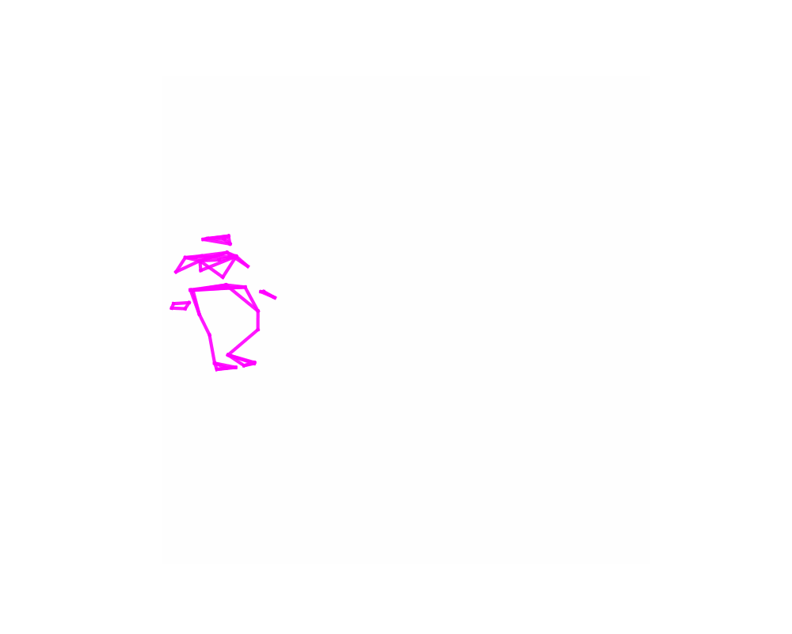
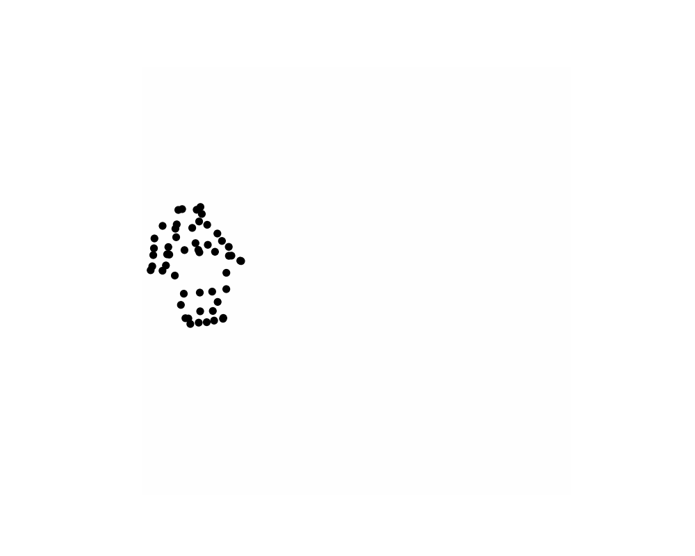

# HathorSeq: Motion Capture Sequence Labeler
## Project Overview

**HathorSeq** is a comprehensive tool for labeling and segmenting motion capture (mocap) sequences. Named after Hathor, the Egyptian goddess of dance, this tool enables researchers to efficiently annotate mocap data with textual labels, segment sequences, and generate various visualization styles.

Inspired by the PirouNet paper's approach to dance movement analysis using Laban Movement Analysis (LMA), HathorSeq bridges the gap between motion capture data and textual descriptions by providing an intuitive interface for labeling and segmenting sequences that can later be used for machine learning tasks.

## Features

HathorSeq offers a powerful set of features for mocap data processing:

🔹 **Sequence Labeling**: Apply textual labels to specific segments of motion capture data
  
🔹 **Flexible Sequence Definition**: Define sequences by length or by start/end frames
  
🔹 **Interactive Visualization**: View 3D skeleton animations in real-time while labeling
  
🔹 **Multiple Visualization Styles**: Toggle between lines, dots, or combined representations
  
🔹 **Batch Visualization Generation**: Generate multiple visualization styles for all mocap files in a directory
  
🔹 **Customizable Export**: Export labeled sequences with adjustable parameters:
  - Sequence length
  - Overlap between sequences 
  - Include/exclude unlabeled segments
  - Include/exclude specific joints
  
🔹 **Compatibility**: Works with standard .npy mocap files

## Installation

### Requirements

Clone the repository and install the required dependencies:

```bash
git clone https://github.com/ahmedmo1242/DanceNet.git
cd DanceNet/hathorseq
pip install -r requirements.txt
```

## Usage

### Sequence Labeler GUI

The main interface for labeling motion capture sequences:

```bash
python sequence_labeler.py
```

This will open the interactive GUI where you can:
1. Load motion capture data (.npy files)
2. Navigate through frames
3. Define sequences by length or start/end frames
4. Add text labels to sequences
5. Export labeled sequences to a dataset

### Generating Visualizations

Generate multiple visualization styles for all mocap files in a directory:

```bash
python generate_visualizations.py --input ./examples --output ./output/visualizations
```

Options:
- `--input`, `-i`: Input directory with .npy files (default: ./examples)
- `--output`, `-o`: Output directory (default: ./output/visualizations)
- `--frames`, `-f`: Maximum frames per visualization (default: 200)
- `--formats`: Output formats, can be "mp4" and/or "gif" (default: mp4)
- `--styles`: Visualization styles to generate (default: all)
  - Available styles: "lines_only", "dots_only", "lines_and_dots", "with_background", "cloud"
- `--ffmpeg`: Path to ffmpeg executable (optional)

Example:
```bash
python generate_visualizations.py --input ./examples --output ./output/visualizations --formats mp4 gif --styles lines_only dots_only
```

## Workflow Example

1. **Load Motion Capture Data**:
   - Open the sequence labeler and load a `.npy` motion capture file

2. **Navigate through Frames**:
   - Use the slider or navigation buttons to view the sequence
   - Play the animation at various speeds

3. **Define and Label Sequences**:
   - Set start frame and sequence length
   - Add a meaningful label (e.g., "spin", "jump", "wave")
   - Add the labeled sequence to the list

4. **Export Dataset**:
   - Configure export parameters (sequence length, overlap, etc.)
   - Export to a structured NPY dataset for machine learning tasks

## Visualization Examples

HathorSeq supports multiple visualization styles to help you better understand and analyze motion capture data:

### Lines Only
Shows the skeleton structure without joint markers


### Dots Only
Shows joint positions without connecting lines


### Lines and Dots
Combined visualization showing both skeleton and joint markers


